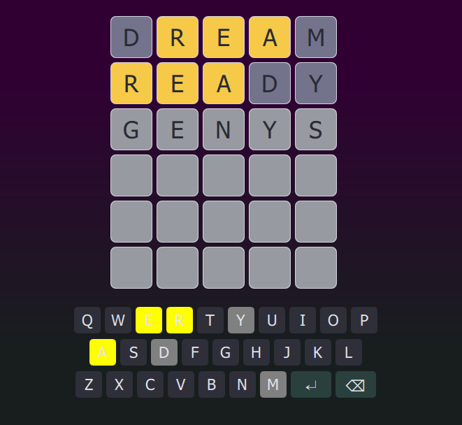
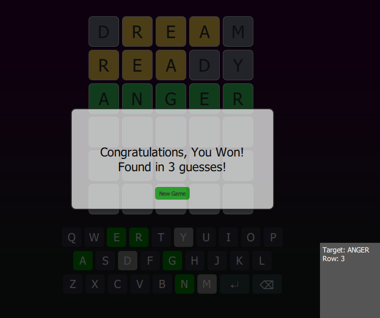

# Mordle-Guess-Words-
a Wordle-Game. Let's Guess Some Words!
#### Project Overview  
This project is a demonstration of a Wordle-inspired game built using modern development tools. It leverages **Qt 5.14** to create a sleek, responsive user interface with **QML** while harnessing the power and efficiency of **C++** for its core game logic. The build process is managed by **CMake**, and the project is compiled using **MinGW 32-bit**, showcasing a robust example of cross-platform application development and modern C++ design practices.

#### Overview  
For an initial preview of the game’s functionality, two screenshots have been included in the repository:  
-   
-   

#### Additional Information  
- A debug console is available in-game via the **Shift + V** key combination. This handy feature displays the target word and current row, making it easier to test and debug the application during development.
